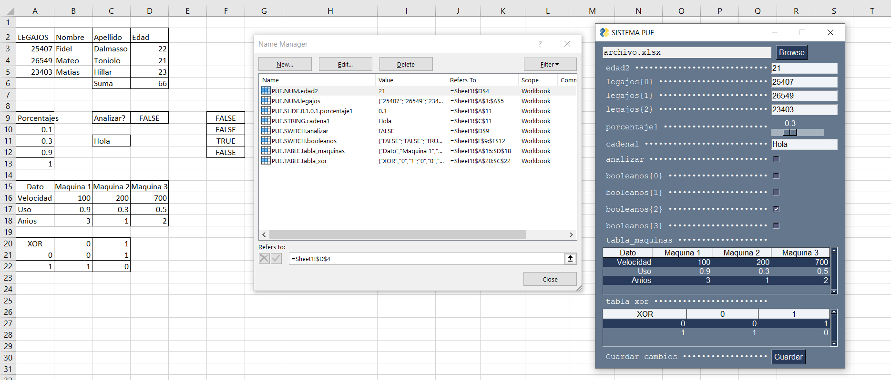

# PUE: Herramienta GUI para editar archivos Excel

El script de Python permite editar visualmente celdas de archivos Excel. Para ello, es necesario *taggear* las celdas y/o rangos correspondientes mediante el *Name Manager*.

# Tags disponibles
## Primitivos
```
PUE.NUM.Nombre
PUE.STRING.Nombre
```

## Tablas
```
PUE.TABLE.Nombre
```

## Especiales
```
PUE.SWITCH.Nombre
PUE.SLIDER.MinValue.MaxValue.Resolution.Nombre
PUE.COMBO.{valores}.Nombre (no disponible)
```

# Nota
LibreOffice no permite crear un nombre que incluya el caracter punto (.) -> a cambio de esto, puede usarse el guión bajo (_) como separador. 